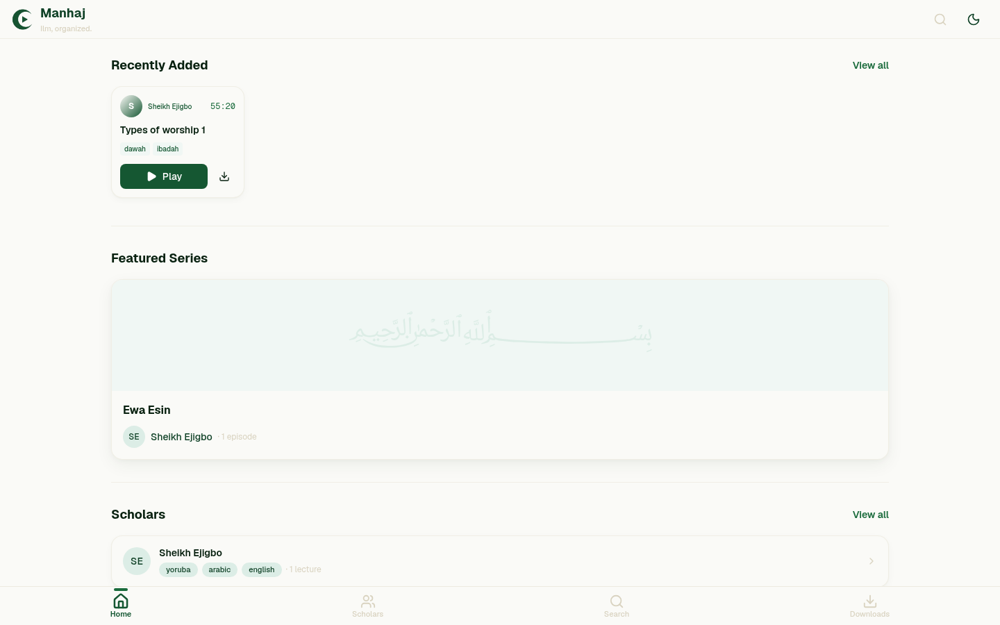
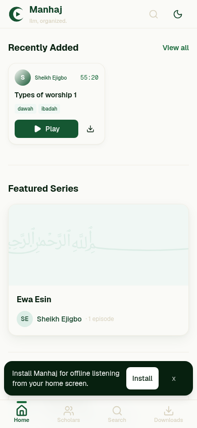
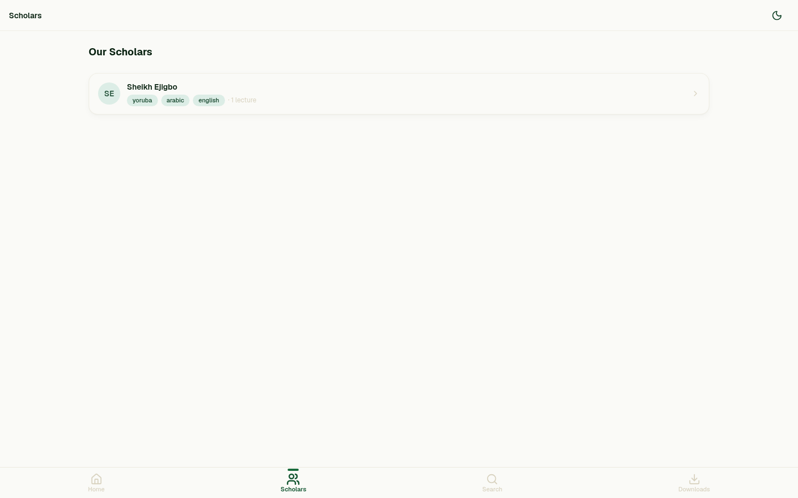
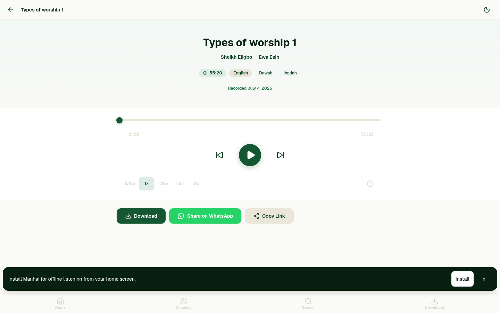
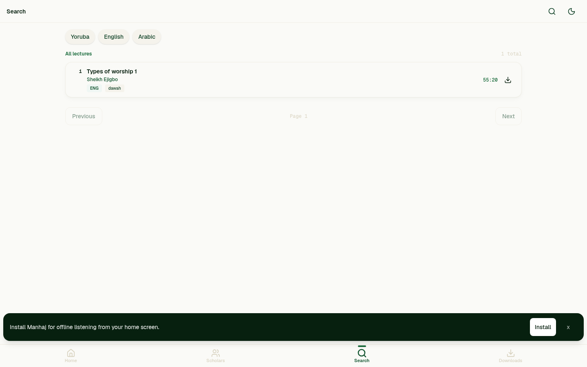
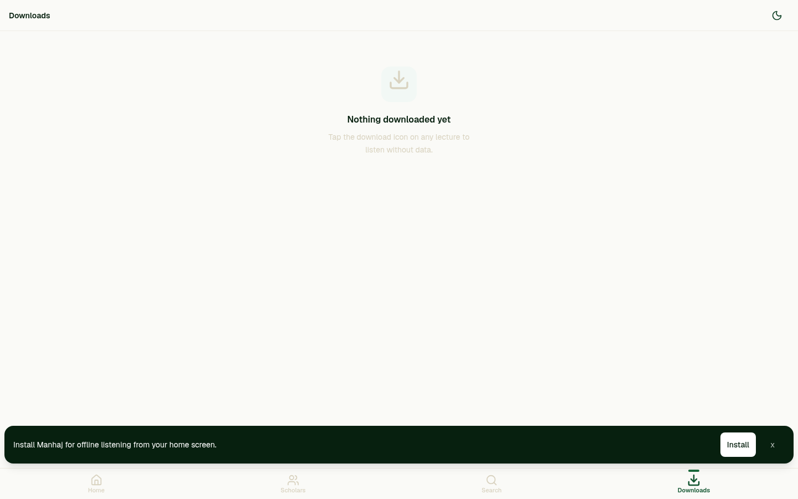
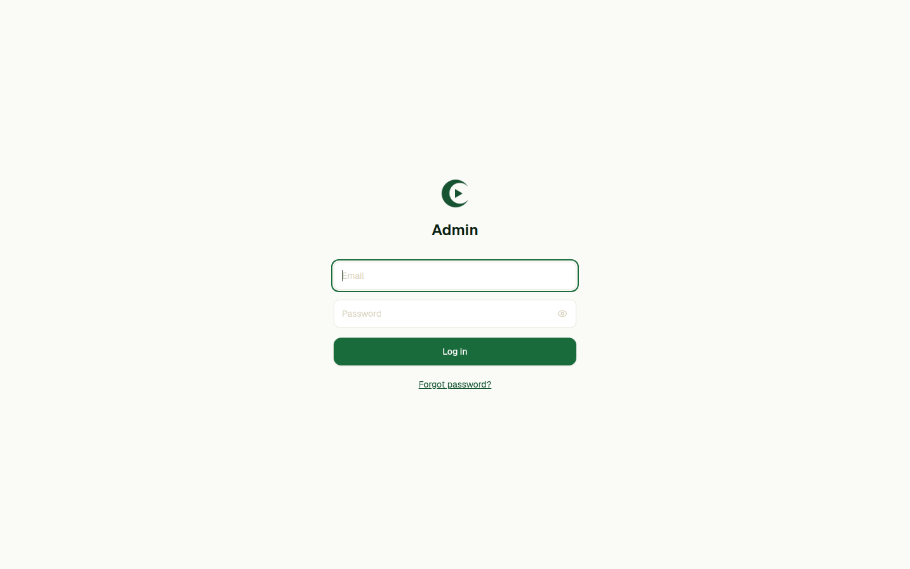

# Manhaj — *Ilm, organized.*

<p align="center">
  
  <br/>
  <em>Audio lecture platform for Nigerian Sunni/Salafi scholars & their students.</em>
  <br/><br/>
  <a href="https://manhaj-sunnah.vercel.app/"><strong>Live Demo → manhaj-sunnah.vercel.app</strong></a>
</p>

<p align="center">
  
  
  
  
  
  
</p>

---

## Why Manhaj?

Nigerian Salafi/Sunni lecture content is scattered across WhatsApp, YouTube, Facebook and Telegram. No single place exists to find **all of a specific scholar's lectures organized by series** — offline, searchable, and respectful of data/power constraints.

Manhaj fixes that: a curated, scholar-centric library you can **browse, search, stream, and download for offline listening** on a mid-range Android phone.

---

## Screenshots

### Student / Aspirant — Public Experience

<table>
<tr>
<td width="50%">

**Home — Desktop**
<br/>


*Recently Added · Featured Series · Scholars*

</td>
<td width="50%">

**Home — Mobile**
<br/>


*Mobile-first, bottom nav, PWA install banner*

</td>
</tr>
<tr>
<td>

**Scholars**



*Browse all scholars → profile → series → episodes*

</td>
<td>

**Lecture Player**



*Waveform, speed 0.75–2×, sleep timer, queue, WhatsApp share*

</td>
</tr>
<tr>
<td>

**Search**



*Instant search by title / scholar / series / tags, language filters*

</td>
<td>

**Offline Downloads**



*IndexedDB — play without internet, pause/resume, auto-retry with Range*

</td>
</tr>
</table>

### Admin — Scholar Management

<table>
<tr>
<td width="50%">

**Admin Login**


*Supabase Auth · `super_admin` & `scholar_admin` roles*

</td>
<td width="50%">

**Protected Dashboard**



*Unauthenticated `/admin` redirects to login — role-scoped CRUD*

</td>
</tr>
</table>

> All screenshots captured from production (`https://manhaj-sunnah.vercel.app/`) via automated browser. Admin dashboard content is auth-gated — the screenshot shows the guard redirect.

---

## Features

### For Students / Aspirants

- **Scholar profiles** — photo, bio, languages (yoruba/english/arabic), social links, episode counts
- **Lecture library** — hierarchy `Scholar → Series → Episodes`, language filtering
- **Audio player** — Howler/HTML5, play/pause/seek, speed 0.75–2×, sleep timer (15/30/60m), mini-player, queue prev/next
- **Playback continuity** — versioned IndexedDB history resumes meaningful positions across sessions
- **Offline download** — the #1 differentiator; audio + offline page cached (`manhaj-pages` / `manhaj-audio`)
- **Resilient transfers** — transient failures (network/429/5xx) retry ×3 with backoff + HTTP Range resumption, pause/resume/delete
- **Cached edit rule** — metadata-only changes refresh the download; a changed `audio_url` marks the old file outdated (explicit re-download)
- **Search** — `pg_trgm` full-text, debounced, language facets
- **Share** — per-lecture link, one-tap WhatsApp, Open Graph preview
- **PWA** — Serwist service worker (`/sw.js`), installable, offline shell at `/offline/[slug]`

### For Admins

- **Two roles:**
  - `super_admin` — full access
  - `scholar_admin` — scoped to one `scholar_id`
- **Recoverable publishing** — every mutating operation requires `X-Operation-ID: uuidv4`. Replays return the original result; conflicting reuse → `409 IDEMPOTENCY_CONFLICT`; concurrent claim → `409 OPERATION_IN_PROGRESS`; lease 30m via `episode_operations` + `claim_episode_operation` RPC
- **Upload** — R2 via S3 API (`lib/r2.ts`), server-side duration via `music-metadata`
- **CMS** — scholars / series / episodes CRUD, scoped queries in `lib/admin-operations.ts`

---

## Tech Stack

| Layer | Technology |
|-------|------------|
| Frontend | Next.js 16.3 (App Router, `reactCompiler: true`), React 19, TypeScript 5+ |
| Styling | Tailwind CSS v4 (`@import "tailwindcss"` in `app/globals.css`, no config file) |
| Audio | Howler.js |
| Backend / DB | Supabase (Postgres + Auth, SSR cookies via `proxy.ts`) |
| Storage | Cloudflare R2 (S3-compatible) |
| Deployment | Vercel (`vercel.json`, preview per PR) |
| PWA | Serwist (`app/sw.ts` → `public/sw.js`, `CacheFirst` audio, `NetworkFirst` pages) |
| State | Zustand (`store/player.ts`, `store/downloads.ts`) + TanStack Query |
| Lint/Format | Biome (`pnpm lint` / `pnpm format`) |
| Tests | Vitest (contract/runtime tests) |
| CI | GitHub Actions — lint, typecheck, test, build; CodeQL; Dependency Review |

---

## Architecture

```
scholars → series → episodes        (content hierarchy)
admins → auth.users(id)             (role + scholar_id scoping)
episode_operations                  (idempotency ledger)
```

- **Route groups:** `(public)/` user pages, `(admin)/` protected CMS
- **Guard:** `proxy.ts` (Next.js 16) checks Supabase SSR session for `/admin*` and `/api/admin/*`
- **Path alias:** `@/*` → project root
- **Single-package repo** (`pnpm-workspace.yaml` only ignores built deps)

### URL Structure

```
/                           → Home
/scholars                   → All scholars
/scholars/[slug]            → Scholar profile + series
/scholars/[slug]/[series]   → Series + episodes
/lectures/[slug]            → Lecture (shareable, SEO'd, player)
/search?q=...               → Search
/downloads                  → Local downloads (IndexedDB)
/offline/[slug]              → Offline fallback for downloaded lectures
/admin                      → Admin panel (auth-gated)
/admin/login                → Admin sign-in
```

### Key Types

```ts
Language = "yoruba" | "english" | "arabic"
Speed    = 0.75 | 1 | 1.25 | 1.5 | 2
AdminRole = "super_admin" | "scholar_admin"
Tag = "aqeedah" | "fiqh" | "tafseer" | "hadith" | "seerah" | "manhaj" | "adab" | "family" | "ibadah" | "dawah" | "ruqyah" | "arabic"
```

### Player Store (Zustand)

`store/player.ts` — single source of truth: `currentEpisode`, `queue`, `isPlaying`, `currentTime`, `duration`, `speed`, `isLoading`, `sleepTimerRemaining`. `setEpisode()` resets time+play; `clear()` resets including speed.

### PWA

- Serwist generates `public/sw.js` from `app/sw.ts` (webpack build `pnpm build -- --webpack`)
- Runtime caches: pages (`NetworkFirst`), audio mp3/wav/ogg (`CacheFirst`, 100 entries, 30d, range support), images
- Icons: `public/icons/icon-{192,512}.png` + maskable, manifest at `public/manifest.json`
- Component `components/layout/sw-register.tsx` registers `/sw.js`

---

## Prerequisites

- Node.js ≥ 20
- pnpm ≥ 9

---

## Getting Started

```bash
pnpm install
cp .env.example .env.local   # fill Supabase + R2
pnpm dev                     # http://localhost:3000 (Turbopack)
```

### Environment Variables

| Variable | Description |
|----------|-------------|
| `NEXT_PUBLIC_APP_URL` | App URL |
| `NEXT_PUBLIC_APP_NAME` | App name |
| `NEXT_PUBLIC_SUPABASE_URL` | Supabase URL |
| `NEXT_PUBLIC_SUPABASE_ANON_KEY` | Supabase anon key |
| `SUPABASE_SERVICE_ROLE_KEY` | Supabase service role |
| `CLOUDFLARE_ACCOUNT_ID` | Cloudflare account |
| `R2_ACCESS_KEY_ID` / `R2_SECRET_ACCESS_KEY` | R2 creds |
| `R2_BUCKET_NAME` | R2 bucket |
| `NEXT_PUBLIC_R2_PUBLIC_URL` | R2 public base |
| `ADMIN_BOOTSTRAP_EMAIL` / `ADMIN_BOOTSTRAP_SECRET` | Initial admin |

### Supabase Setup

1. Apply `supabase/migrations/003_episode_operations.sql` (idempotent) — creates `episode_operations`, `claim_episode_operation()` RPC, 30m lease, RLS, relaxes `episodes.audio_url` for drafts.
2. Configure Auth, Storage, and `admins` table per `supabase/` migrations.

### R2 Upload Flow

Scholar's admin receives audio (WhatsApp/email) → upload via admin portal (`lib/r2.ts` S3) → `music-metadata` extracts `duration_seconds` server-side → episode row created → live.

---

## Scripts

| Command | Action |
|---------|--------|
| `pnpm dev` | Dev server (Turbopack) |
| `pnpm build` | Production build (webpack + Serwist) |
| `pnpm start` | Start prod server |
| `pnpm lint` | Biome check |
| `pnpm format` | Biome write |
| `pnpm typecheck` | `tsc --noEmit` |
| `pnpm test` | `vitest run` |
| `pnpm exec tsc --noEmit` | Typecheck only |

---

## Design Principles

- **Content first** — the lecturer's voice is the product
- **Low-data respectful** — lazy audio, never autoplay
- **Built for Android mid-range** — test on a ₦80k phone, 390×844 primary viewport
- **Arabic/Islamic aesthetic** — warm neutrals, forest greens, cream/sand, no clutter
- **No engagement theater** — no sidebar, likes, comments, or metrics

---

## Security

- Secret scanning + push protection enabled (GitHub)
- Dependabot (npm + GitHub Actions → `dev`), grouped minor/patch
- CodeQL + Dependency Review on PRs
- Branch protection on `main`: required PR, required reviews, required status checks (`Quality`, `Build`, `CodeQL`, `Dependency Review`), no force-push/deletion

See [SECURITY.md](SECURITY.md) for reporting.

---

## Roadmap

- **v1 (MVP) — PWA web app** — ✅ in progress (scholar/series/episodes, player, offline, search, admin)
- **v2** — native iOS/Android, bookmarks, scholar self-upload, dark mode, multi-language UI
- **v3** — video, live streaming

---

## Contributing

PRs to `dev` → reviewed → squash-merged to `main`. Run `pnpm lint && pnpm typecheck && pnpm test && pnpm build` before pushing. Do not commit `.env`, build artifacts, or `public/sw.js` (generated).

---

## License

MIT — see `LICENSE` if present. Content (audio) remains property of respective scholars.

---

<p align="center"><em>Ilm, organized.</em> — Built for the Nigerian Salafi/Sunni community, with ❤️ and barakah.</p>
